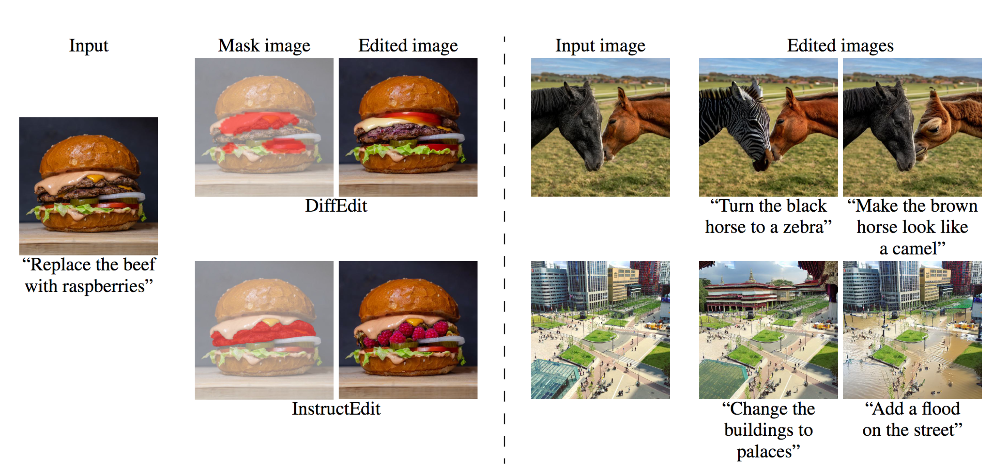
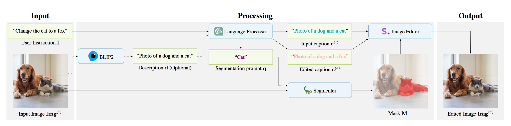

# :writing_hand: InstructEdit

[](https://arxiv.org/abs/2305.18047)
:rocket: [Project page](https://qianwangx.github.io/InstructEdit/)


**InstructEdit: Improving Automatic Masks for Diffusion-based Image Editing With User Instructions**.<br> 
Qian Wang, Biao Zhang, Michael Birsak, Peter Wonka <br>
This code base is modified based on the repo [Grounded Segment Anything](https://github.com/IDEA-Research/Grounded-Segment-Anything). 

### Pipeline

Our proposed framework has three components: language processor, segmenter, and image editor. Language processor processes the user instruction using a large language model. The goal of this processing is to parse the user instruction and output prompts for the segmenter and captions for the image editor. We adopt ChatGPT and optionally BLIP2 for this step. Segmenter uses the segmentation prompt provided by the language processor. We employ a state-of-the-art segmentation framework Grounded Segment Anything to automatically generate a high-quality mask based on the segmentation prompt. Image editor uses the captions from the language processor and the masks from the segmenter to compute the edited image. We adopt Stable Diffusion and the mask-guided generation from DiffEdit for this purpose.

### Set up environment
Please set the environment variable manually as follows if you want to build a local GPU environment:
```bash
export AM_I_DOCKER=False
export BUILD_WITH_CUDA=True
export CUDA_HOME=/path/to/cuda-11.3/
```

Install Segment Anything:

```bash
python -m pip install -e segment_anything
```

Install Grounding DINO:

```bash
python -m pip install -e GroundingDINO
```

Install diffusers:

```bash
pip install --upgrade diffusers[torch]
```

The following optional dependencies are necessary for mask post-processing, saving masks in COCO format, the example notebooks, and exporting the model in ONNX format. `jupyter` is also required to run the example notebooks.

```
pip install opencv-python pycocotools matplotlib onnxruntime onnx ipykernel
```

More details can be found in [install segment anything](https://github.com/facebookresearch/segment-anything#installation) and [install GroundingDINO](https://github.com/IDEA-Research/GroundingDINO#install) and [install OSX](https://github.com/IDEA-Research/OSX)

After setting up the environment, please also specify the <b>openai key</b> in `chatgpt.py`.

### Playground
We provide a notebook (`grounded_sam_instructedit_demo.ipynb`), a python script (`grounded_sam_instructedit_demo.py`) and a gradio app (`gradio_intructedit.py`) for you to play around with.

## Citation
```
@misc{wang2023instructedit,
      title={InstructEdit: Improving Automatic Masks for Diffusion-based Image Editing With User Instructions}, 
      author={Qian Wang and Biao Zhang and Michael Birsak and Peter Wonka},
      year={2023},
      eprint={2305.18047},
      archivePrefix={arXiv},
      primaryClass={cs.CV}
}
```
